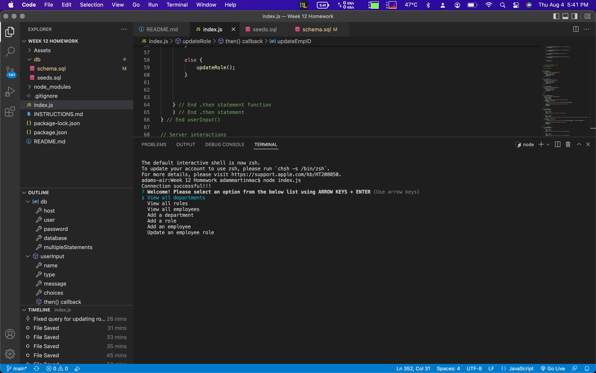
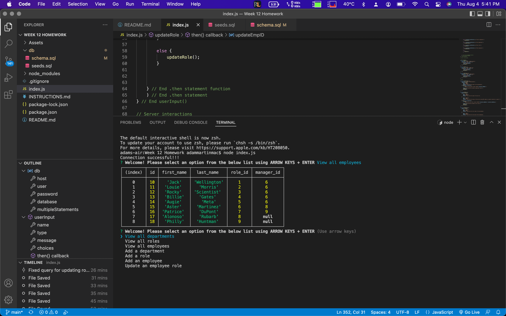
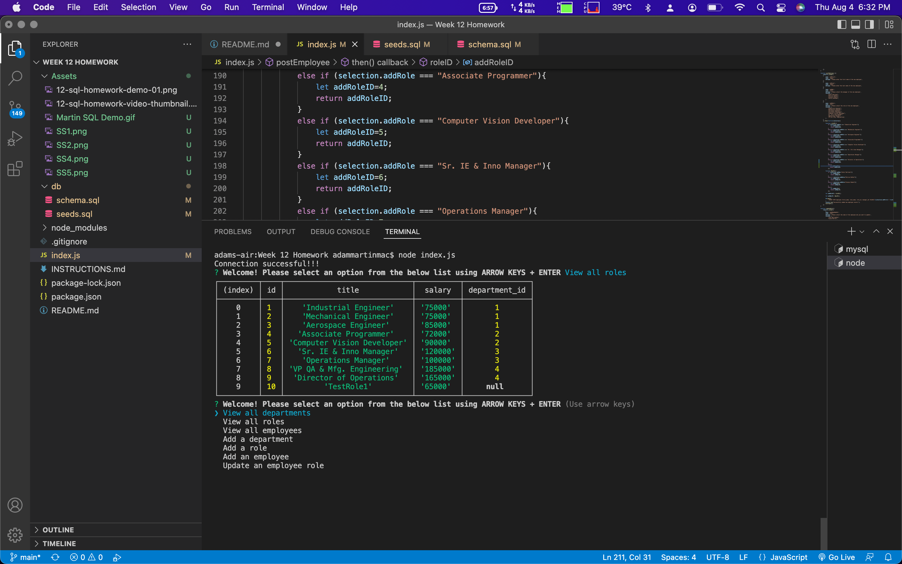
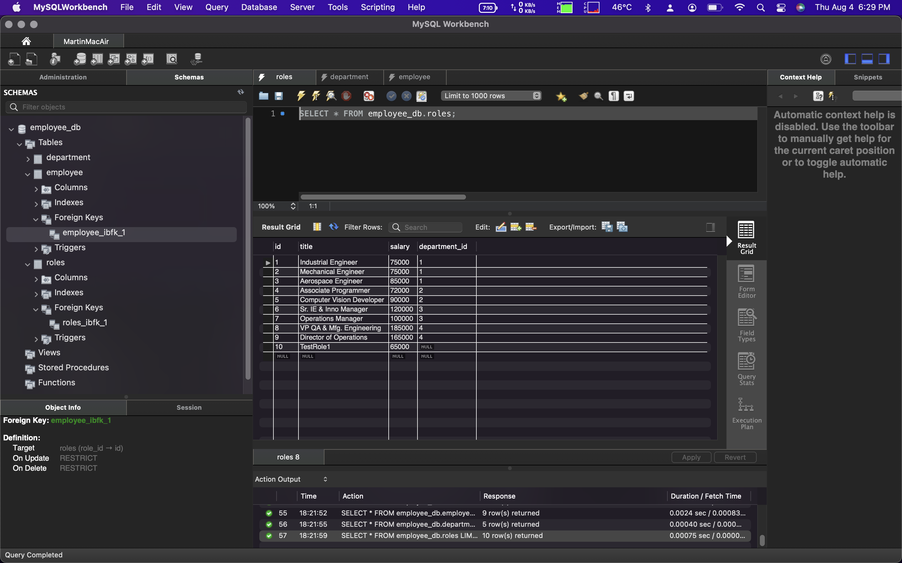

## DEV INFO
Name: Adam Martin

App Title: Employee Manager

Due Date: 7/30/2022

## APP DESCRIPTION
This app allows a user to use the command line to interact with employee data. The user will be able to view employee names, departments, roles, and salaries. The user will also be able to add values to any of the 3 tables as well. 

## DEPENDENCIES
inquirer for user input

mysql2 for server interaction

## SCREENSHOTS

## VIDEO WALKTHROUGH
